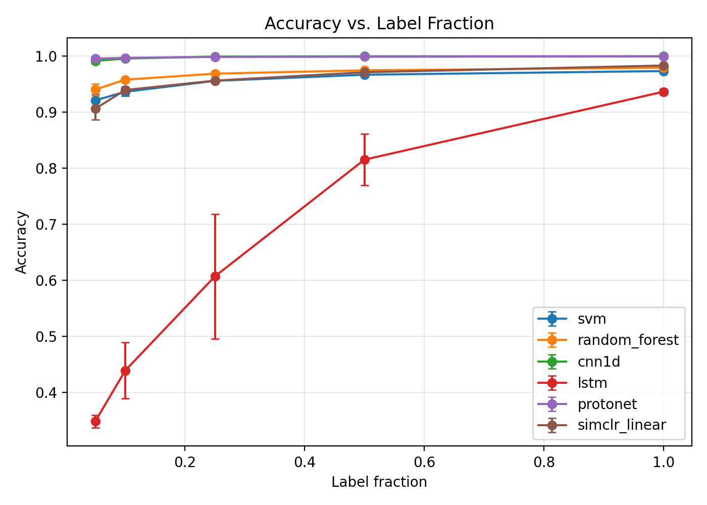

<div align="center">

# Few-Shot Bearing Fault Diagnosis

A label-efficient fault diagnosis pipeline for rotating machinery, comparing supervised
baselines against few-shot and self-supervised methods across varying label-scarcity
levels on the CWRU bearing dataset.

[](https://github.com/prakash-ukhalkar/few-shot-bearing-fault-diagnosis/actions/workflows/tests.yml)
[](LICENSE)
[](https://www.python.org/downloads/)
[](https://pytorch.org/)
[](https://scikit-learn.org/)
[](https://github.com/prakash-ukhalkar)

</div>

Industrial fault diagnosis models typically assume abundant labeled failure data, which
is unrealistic in practice — failures are rare, and labeling requires expert inspection.
This project compares standard supervised classifiers against few-shot and
self-supervised approaches across label-scarcity levels (5%, 10%, 25%, 50%, 100% of
available labels) to measure which method degrades most gracefully as labeled data
shrinks.

## Project structure

```
few-shot-bearing-fault-diagnosis/
├── configs/                     # YAML experiment configs
│   ├── default.yaml             # main label-fraction sweep, same-condition split
│   └── cross_load.yaml          # cross-load generalization sweep
├── data/
│   ├── raw/                     # downloaded .mat files (gitignored)
│   └── processed/                # windowed .npz arrays (gitignored)
├── notebooks/                   # Colab-runnable notebook + exploratory analysis
├── results/
│   ├── figures/                 # accuracy-vs-label-fraction plots, confusion matrices
│   ├── tables/                  # summary CSVs, significance test results
│   └── models/                  # trained model checkpoints (gitignored)
├── src/
│   ├── data/                    # CWRU loading, download, preprocessing, splitting
│   ├── features/                # hand-crafted time/spectral feature extraction
│   ├── models/                  # SVM/RF, 1D-CNN, LSTM, Prototypical Networks
│   ├── self_supervised/         # SimCLR-style contrastive + masked reconstruction
│   ├── evaluation/               # metrics, significance tests, plotting
│   └── utils/                   # seeding, config loading
├── tests/                       # unit tests (preprocessing, windowing, metrics, models)
├── train.py                     # train/evaluate one method @ one fraction/seed
├── run_all_experiments.py       # full grid sweep + aggregation + plots
├── requirements.txt             # pinned dependencies
└── .github/workflows/tests.yml  # CI: pytest on push/PR to main
```

## Quickstart

```bash
# 1. Create environment
python -m venv .venv
source .venv/bin/activate  # or .venv\Scripts\activate on Windows
pip install -r requirements.txt

# 2. Download the CWRU dataset subset (no credentials required)
python -m src.data.download_cwru --out data/raw/cwru

# 3. Build windowed train/test arrays
python -m src.data.build_dataset --raw data/raw/cwru --out data/processed \
    --window-size 1024 --stride 512 --channel DE

# 4. Run a single method/label-fraction/seed configuration
python train.py --config configs/default.yaml --method protonet \
    --label-fraction 0.1 --seed 0

# 5. Run the full experiment grid (all methods x label fractions x seeds)
python run_all_experiments.py --config configs/default.yaml

# 6. Cross-load generalization experiment (train on 0-2 HP, test on 3 HP)
python run_all_experiments.py --config configs/cross_load.yaml

# Run tests
pytest tests/ -v
```

A ready-to-run Colab notebook (`notebooks/colab_run_experiments.ipynb`) reproduces the
entire pipeline end to end, with incremental checkpointing so long runs can resume after
a disconnect.

All training runs on CPU by default (`training.device: cpu` in the configs);
backbones are kept small (<500K parameters) and pretraining/episodic training
budgets are sized to complete in a few hours on a laptop CPU.

## Methods compared

- **SVM / Random Forest** on hand-crafted time-domain and spectral features
  (`src/features/handcrafted.py`) — classical supervised baseline.
- **1D-CNN** / **shallow LSTM** trained directly on raw windowed vibration
  signal — supervised deep baseline.
- **Prototypical Networks** (Snell et al., 2017) — metric-learning few-shot
  method; class prototypes are the mean embedding of the support set, query
  samples classified by nearest prototype.
- **SimCLR-style contrastive pretraining** with signal-specific augmentations
  (jitter, scaling, time-warping) on unlabeled data, followed by a linear
  probe fine-tuned on the scarce labels.
- **Masked-signal reconstruction** pretext task (`src/self_supervised/masked_reconstruction.py`)
  as an ablation against contrastive pretraining.

## Results

Accuracy (mean over 5 seeds) at each label fraction, same-condition split
(`configs/default.yaml`), on the real CWRU 12 kHz Drive-End dataset:

| Method         |   5%  |  10%  |  25%  |  50%  | 100%  |
|----------------|:-----:|:-----:|:-----:|:-----:|:-----:|
| Prototypical Net | 0.996 | 0.997 | 0.999 | 0.999 | 1.000 |
| 1D-CNN         | 0.992 | 0.996 | 1.000 | 1.000 | 1.000 |
| SimCLR + linear probe | 0.907 | 0.940 | 0.957 | 0.971 | 0.984 |
| Random Forest  | 0.941 | 0.958 | 0.969 | 0.975 | 0.980 |
| SVM            | 0.921 | 0.937 | 0.956 | 0.967 | 0.974 |
| LSTM           | 0.349 | 0.439 | 0.607 | 0.816 | 0.937 |

The central finding: **Prototypical Networks and SimCLR contrastive pretraining stay
near their ceiling accuracy even at 5% labels, while the plain LSTM baseline collapses**
— a 65-point accuracy gap at the 5% label fraction that closes to under 7 points at
100%. This gap is statistically significant (paired t-test, p < 1e-7 at every label
fraction below 100%). Full results, per-class confusion matrices, and cross-load
generalization numbers (train on 0–2 HP, evaluate on held-out 3 HP) are in
`results/tables/` and `results/figures/`.



## Experimental design

- Each method is trained/evaluated at label fractions `[5%, 10%, 25%, 50%, 100%]`,
  5 seeds per configuration (`configs/default.yaml`), reporting mean ± std.
- Metrics: accuracy, macro-F1 (fault classes may be imbalanced), and per-class
  confusion matrices (`src/evaluation/metrics.py`, `src/evaluation/plots.py`).
- Statistical significance between methods at each label fraction is assessed
  with a paired t-test and Wilcoxon signed-rank test across seeds
  (`src/evaluation/significance.py`).
- Cross-load generalization: `configs/cross_load.yaml` trains on CWRU loads
  0-2 HP and evaluates on the held-out 3 HP condition, testing robustness
  beyond same-condition overfitting.
- The central figure is accuracy (and macro-F1) vs. label fraction, one curve
  per method with error bars across seeds
  (`src/evaluation/plots.py::plot_accuracy_vs_label_fraction`).

## Reproducibility & data availability

**Data sources (all free, no credentialed/paid access required):**

- **CWRU Bearing Dataset** — Case Western Reserve University Bearing Data
  Center (https://engineering.case.edu/bearingdatacenter). Files are served
  publicly with no login required. This project uses the **12 kHz Drive-End
  (DE) fault dataset**, fault diameters **0.007" / 0.014" / 0.021"**, fault
  location **OR@6:00** for outer-race faults, all four motor **load
  conditions (0-3 HP, approx. 1730-1797 RPM)**, plus the normal baseline —
  10 classes total. The exact file-number-to-label mapping is fixed and
  version-controlled in `src/data/cwru_manifest.py`, so re-running
  `src/data/download_cwru.py` deterministically reconstructs the identical
  raw dataset used in this project.
- **NASA C-MAPSS** turbofan degradation dataset (NASA Prognostics Data
  Repository) — optional secondary dataset for generalization experiments
  beyond CWRU; publicly downloadable with no credentials.
- **PRONOSTIA/FEMTO** bearing run-to-failure dataset — optional third dataset
  for cross-dataset generalization claims; publicly available.

**No raw data is committed to this repository** (`data/raw/`, `data/processed/`,
and `results/models/` are gitignored — raw CWRU files alone are tens of MB).
Instead, `src/data/download_cwru.py` and `src/data/build_dataset.py`
deterministically regenerate the exact processed dataset from the public
source, so the full pipeline can be reproduced from a clean checkout with:

```bash
python -m src.data.download_cwru --out data/raw/cwru
python -m src.data.build_dataset --raw data/raw/cwru --out data/processed
python run_all_experiments.py --config configs/default.yaml
```

All dependency versions are pinned exactly in `requirements.txt` for
long-term reproducibility.

## License

MIT — see [LICENSE](LICENSE).

---

<div align="center">

### Citation

If this repository is useful in your work, please cite it as:

```bibtex
@software{ukhalkar_few_shot_bearing_fault_diagnosis,
  author = {Ukhalkar, Prakash},
  title  = {Few-Shot Bearing Fault Diagnosis},
  year   = {2026},
  url    = {https://github.com/prakash-ukhalkar/few-shot-bearing-fault-diagnosis}
}
```

### Author

**Prakash Ukhalkar**
[GitHub @prakash-ukhalkar](https://github.com/prakash-ukhalkar)
</div>
